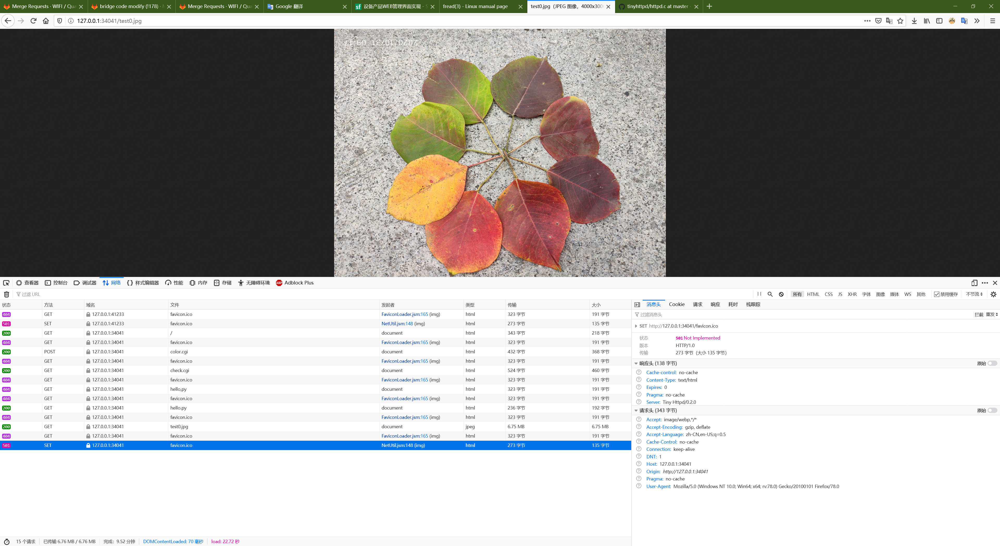

# Tiny HTTPd

> Fork from [Tiny HTTPd](http://tinyhttpd.sourceforge.net/)

## MDN HTTP

* [Tiny HTTPd README](README)
* [HTTP Headers](https://developer.mozilla.org/zh-CN/docs/Web/HTTP/Headers)
* [常见 MIME 类型列表](https://developer.mozilla.org/zh-CN/docs/Web/HTTP/Basics_of_HTTP/MIME_types/Common_types)
* [HTTP 响应代码](https://developer.mozilla.org/zh-CN/docs/Web/HTTP/Status)

## make & run

```bash
make clean && make && rm httpd_debug.log && ./httpd
```

## debug



```debug
===[1617783841][DEBUG]=== main(httpd.c:796) httpd running on port 34041
===[1617783852][DEBUG]=== httpd_accept_request(httpd.c:644) method = [GET]
===[1617783852][DEBUG]=== httpd_accept_request(httpd.c:671) url = [/]
===[1617783852][DEBUG]=== httpd_accept_request(httpd.c:695) path = [/tmp/www/htdocs/index.html]
===[1617783852][DEBUG]=== httpd_mime_types(httpd.c:79) filename = [/tmp/www/htdocs/index.html], ext = [html]
===[1617783852][DEBUG]=== httpd_mime_types(httpd.c:152) filename = [/tmp/www/htdocs/index.html], mime = [2]
===[1617783852][DEBUG]=== httpd_accept_request(httpd.c:728) httpd_serve_file [/tmp/www/htdocs/index.html]
===[1617783852][DEBUG]=== httpd_mime_types(httpd.c:79) filename = [/tmp/www/htdocs/index.html], ext = [html]
===[1617783852][DEBUG]=== httpd_mime_types(httpd.c:152) filename = [/tmp/www/htdocs/index.html], mime = [2]
===[1617783852][DEBUG]=== httpd_content_type(httpd.c:197) filename = [/tmp/www/htdocs/index.html], content_type = [text/html]
===[1617783852][DEBUG]=== httpd_status_code(httpd.c:264) code = [200], status = [200 OK]
===[1617783852][DEBUG]=== httpd_headers(httpd.c:312) send buf = [HTTP/1.0 200 OK
Server: Tiny Httpd/0.2.0
Cache-control: no-cache
Pragma: no-cache
Expires: 0
Content-Type: text/html

]
===[1617783852][DEBUG]=== httpd_cat_file(httpd.c:458) send buf len[218]
===[1617783852][DEBUG]=== httpd_accept_request(httpd.c:644) method = [GET]
===[1617783852][DEBUG]=== httpd_accept_request(httpd.c:671) url = [/favicon.ico]
===[1617783852][DEBUG]=== httpd_accept_request(httpd.c:695) path = [/tmp/www/htdocs/favicon.ico]
===[1617783852][ERROR]=== httpd_accept_request(httpd.c:699) [stat], errno[2], strerror[No such file or directory]
===[1617783852][DEBUG]=== httpd_status_code(httpd.c:264) code = [404], status = [404 Not Found]
===[1617783852][DEBUG]=== httpd_headers(httpd.c:312) send buf = [HTTP/1.0 404 Not Found
Server: Tiny Httpd/0.2.0
Cache-control: no-cache
Pragma: no-cache
Expires: 0
Content-Type: text/html

<HTML>
<HEAD>
<TITLE>Not Found</TITLE>
</HEAD>
<BODY>
<H1>The server could not fulfill your request because the resource specified is unavailable or nonexistent.</H1>
</BODY>
</HTML>
]
===[1617783857][DEBUG]=== httpd_accept_request(httpd.c:644) method = [POST]
===[1617783857][DEBUG]=== httpd_accept_request(httpd.c:671) url = [/color.cgi]
===[1617783857][DEBUG]=== httpd_accept_request(httpd.c:695) path = [/tmp/www/htdocs/color.cgi]
===[1617783857][DEBUG]=== httpd_mime_types(httpd.c:79) filename = [/tmp/www/htdocs/color.cgi], ext = [cgi]
===[1617783857][DEBUG]=== httpd_mime_types(httpd.c:152) filename = [/tmp/www/htdocs/color.cgi], mime = [10]
===[1617783857][DEBUG]=== httpd_accept_request(httpd.c:722) cgi = [1]
===[1617783857][DEBUG]=== httpd_accept_request(httpd.c:733) httpd_execute_cgi [/tmp/www/htdocs/color.cgi] [POST] [(null)]
===[1617783857][DEBUG]=== httpd_accept_request(httpd.c:644) method = [GET]
===[1617783857][DEBUG]=== httpd_accept_request(httpd.c:671) url = [/favicon.ico]
===[1617783857][DEBUG]=== httpd_accept_request(httpd.c:695) path = [/tmp/www/htdocs/favicon.ico]
===[1617783857][ERROR]=== httpd_accept_request(httpd.c:699) [stat], errno[2], strerror[No such file or directory]
===[1617783857][DEBUG]=== httpd_status_code(httpd.c:264) code = [404], status = [404 Not Found]
===[1617783857][DEBUG]=== httpd_headers(httpd.c:312) send buf = [HTTP/1.0 404 Not Found
Server: Tiny Httpd/0.2.0
Cache-control: no-cache
Pragma: no-cache
Expires: 0
Content-Type: text/html

<HTML>
<HEAD>
<TITLE>Not Found</TITLE>
</HEAD>
<BODY>
<H1>The server could not fulfill your request because the resource specified is unavailable or nonexistent.</H1>
</BODY>
</HTML>
]
===[1617783862][DEBUG]=== httpd_accept_request(httpd.c:644) method = [GET]
===[1617783862][DEBUG]=== httpd_accept_request(httpd.c:671) url = [/check.cgi]
===[1617783862][DEBUG]=== httpd_accept_request(httpd.c:695) path = [/tmp/www/htdocs/check.cgi]
===[1617783862][DEBUG]=== httpd_mime_types(httpd.c:79) filename = [/tmp/www/htdocs/check.cgi], ext = [cgi]
===[1617783862][DEBUG]=== httpd_mime_types(httpd.c:152) filename = [/tmp/www/htdocs/check.cgi], mime = [10]
===[1617783862][DEBUG]=== httpd_accept_request(httpd.c:722) cgi = [1]
===[1617783862][DEBUG]=== httpd_accept_request(httpd.c:733) httpd_execute_cgi [/tmp/www/htdocs/check.cgi] [GET] []
===[1617783862][DEBUG]=== httpd_accept_request(httpd.c:644) method = [GET]
===[1617783862][DEBUG]=== httpd_accept_request(httpd.c:671) url = [/favicon.ico]
===[1617783862][DEBUG]=== httpd_accept_request(httpd.c:695) path = [/tmp/www/htdocs/favicon.ico]
===[1617783862][ERROR]=== httpd_accept_request(httpd.c:699) [stat], errno[2], strerror[No such file or directory]
===[1617783862][DEBUG]=== httpd_status_code(httpd.c:264) code = [404], status = [404 Not Found]
===[1617783862][DEBUG]=== httpd_headers(httpd.c:312) send buf = [HTTP/1.0 404 Not Found
Server: Tiny Httpd/0.2.0
Cache-control: no-cache
Pragma: no-cache
Expires: 0
Content-Type: text/html

<HTML>
<HEAD>
<TITLE>Not Found</TITLE>
</HEAD>
<BODY>
<H1>The server could not fulfill your request because the resource specified is unavailable or nonexistent.</H1>
</BODY>
</HTML>
]
===[1617783868][DEBUG]=== httpd_accept_request(httpd.c:644) method = [GET]
===[1617783868][DEBUG]=== httpd_accept_request(httpd.c:671) url = [/hello,py]
===[1617783868][DEBUG]=== httpd_accept_request(httpd.c:695) path = [/tmp/www/htdocs/hello,py]
===[1617783868][ERROR]=== httpd_accept_request(httpd.c:699) [stat], errno[2], strerror[No such file or directory]
===[1617783868][DEBUG]=== httpd_status_code(httpd.c:264) code = [404], status = [404 Not Found]
===[1617783868][DEBUG]=== httpd_headers(httpd.c:312) send buf = [HTTP/1.0 404 Not Found
Server: Tiny Httpd/0.2.0
Cache-control: no-cache
Pragma: no-cache
Expires: 0
Content-Type: text/html

<HTML>
<HEAD>
<TITLE>Not Found</TITLE>
</HEAD>
<BODY>
<H1>The server could not fulfill your request because the resource specified is unavailable or nonexistent.</H1>
</BODY>
</HTML>
]
===[1617783868][DEBUG]=== httpd_accept_request(httpd.c:644) method = [GET]
===[1617783868][DEBUG]=== httpd_accept_request(httpd.c:671) url = [/favicon.ico]
===[1617783868][DEBUG]=== httpd_accept_request(httpd.c:695) path = [/tmp/www/htdocs/favicon.ico]
===[1617783868][ERROR]=== httpd_accept_request(httpd.c:699) [stat], errno[2], strerror[No such file or directory]
===[1617783868][DEBUG]=== httpd_status_code(httpd.c:264) code = [404], status = [404 Not Found]
===[1617783868][DEBUG]=== httpd_headers(httpd.c:312) send buf = [HTTP/1.0 404 Not Found
Server: Tiny Httpd/0.2.0
Cache-control: no-cache
Pragma: no-cache
Expires: 0
Content-Type: text/html

<HTML>
<HEAD>
<TITLE>Not Found</TITLE>
</HEAD>
<BODY>
<H1>The server could not fulfill your request because the resource specified is unavailable or nonexistent.</H1>
</BODY>
</HTML>
]
===[1617783874][DEBUG]=== httpd_accept_request(httpd.c:644) method = [GET]
===[1617783874][DEBUG]=== httpd_accept_request(httpd.c:671) url = [/hello.py]
===[1617783874][DEBUG]=== httpd_accept_request(httpd.c:695) path = [/tmp/www/htdocs/hello.py]
===[1617783874][DEBUG]=== httpd_mime_types(httpd.c:79) filename = [/tmp/www/htdocs/hello.py], ext = [py]
===[1617783874][DEBUG]=== httpd_mime_types(httpd.c:152) filename = [/tmp/www/htdocs/hello.py], mime = [10]
===[1617783874][DEBUG]=== httpd_accept_request(httpd.c:722) cgi = [1]
===[1617783874][DEBUG]=== httpd_accept_request(httpd.c:733) httpd_execute_cgi [/tmp/www/htdocs/hello.py] [GET] []
===[1617783874][DEBUG]=== httpd_accept_request(httpd.c:644) method = [GET]
===[1617783874][DEBUG]=== httpd_accept_request(httpd.c:671) url = [/favicon.ico]
===[1617783874][DEBUG]=== httpd_accept_request(httpd.c:695) path = [/tmp/www/htdocs/favicon.ico]
===[1617783874][ERROR]=== httpd_accept_request(httpd.c:699) [stat], errno[2], strerror[No such file or directory]
===[1617783874][DEBUG]=== httpd_status_code(httpd.c:264) code = [404], status = [404 Not Found]
===[1617783874][DEBUG]=== httpd_headers(httpd.c:312) send buf = [HTTP/1.0 404 Not Found
Server: Tiny Httpd/0.2.0
Cache-control: no-cache
Pragma: no-cache
Expires: 0
Content-Type: text/html

<HTML>
<HEAD>
<TITLE>Not Found</TITLE>
</HEAD>
<BODY>
<H1>The server could not fulfill your request because the resource specified is unavailable or nonexistent.</H1>
</BODY>
</HTML>
]
===[1617783886][DEBUG]=== httpd_accept_request(httpd.c:644) method = [GET]
===[1617783886][DEBUG]=== httpd_accept_request(httpd.c:671) url = [/test0.jpg]
===[1617783886][DEBUG]=== httpd_accept_request(httpd.c:695) path = [/tmp/www/htdocs/test0.jpg]
===[1617783886][DEBUG]=== httpd_mime_types(httpd.c:79) filename = [/tmp/www/htdocs/test0.jpg], ext = [jpg]
===[1617783886][DEBUG]=== httpd_mime_types(httpd.c:152) filename = [/tmp/www/htdocs/test0.jpg], mime = [6]
===[1617783886][DEBUG]=== httpd_accept_request(httpd.c:728) httpd_serve_file [/tmp/www/htdocs/test0.jpg]
===[1617783886][DEBUG]=== httpd_mime_types(httpd.c:79) filename = [/tmp/www/htdocs/test0.jpg], ext = [jpg]
===[1617783886][DEBUG]=== httpd_mime_types(httpd.c:152) filename = [/tmp/www/htdocs/test0.jpg], mime = [6]
===[1617783886][DEBUG]=== httpd_content_type(httpd.c:197) filename = [/tmp/www/htdocs/test0.jpg], content_type = [image/jpeg]
===[1617783886][DEBUG]=== httpd_status_code(httpd.c:264) code = [200], status = [200 OK]
===[1617783886][DEBUG]=== httpd_headers(httpd.c:312) send buf = [HTTP/1.0 200 OK
Server: Tiny Httpd/0.2.0
Cache-control: no-cache
Pragma: no-cache
Expires: 0
Content-Type: image/jpeg

]
===[1617783886][DEBUG]=== httpd_cat_file(httpd.c:458) send buf len[1024]
===[1617783886][DEBUG]=== httpd_cat_file(httpd.c:458) send buf len[1024]
===[1617783886][DEBUG]=== httpd_cat_file(httpd.c:458) send buf len[1024]
......
===[1617783908][DEBUG]=== httpd_cat_file(httpd.c:458) send buf len[1024]
===[1617783908][DEBUG]=== httpd_cat_file(httpd.c:458) send buf len[1024]
===[1617783908][DEBUG]=== httpd_cat_file(httpd.c:458) send buf len[1024]
===[1617783908][DEBUG]=== httpd_cat_file(httpd.c:458) send buf len[150]
===[1617783909][DEBUG]=== httpd_accept_request(httpd.c:644) method = [GET]
===[1617783909][DEBUG]=== httpd_accept_request(httpd.c:671) url = [/favicon.ico]
===[1617783909][DEBUG]=== httpd_accept_request(httpd.c:695) path = [/tmp/www/htdocs/favicon.ico]
===[1617783909][ERROR]=== httpd_accept_request(httpd.c:699) [stat], errno[2], strerror[No such file or directory]
===[1617783909][DEBUG]=== httpd_status_code(httpd.c:264) code = [404], status = [404 Not Found]
===[1617783909][DEBUG]=== httpd_headers(httpd.c:312) send buf = [HTTP/1.0 404 Not Found
Server: Tiny Httpd/0.2.0
Cache-control: no-cache
Pragma: no-cache
Expires: 0
Content-Type: text/html

<HTML>
<HEAD>
<TITLE>Not Found</TITLE>
</HEAD>
<BODY>
<H1>The server could not fulfill your request because the resource specified is unavailable or nonexistent.</H1>
</BODY>
</HTML>
]
===[1617783917][DEBUG]=== httpd_accept_request(httpd.c:644) method = [SET]
===[1617783917][DEBUG]=== httpd_status_code(httpd.c:264) code = [501], status = [501 Not Implemented]
===[1617783917][DEBUG]=== httpd_headers(httpd.c:312) send buf = [HTTP/1.0 501 Not Implemented
Server: Tiny Httpd/0.2.0
Cache-control: no-cache
Pragma: no-cache
Expires: 0
Content-Type: text/html

<HTML>
<HEAD>
<TITLE>Method Not Implemented</TITLE>
</HEAD>
<BODY>
<H1>HTTP request method not supported.</H1>
</BODY>
</HTML>
]

```
